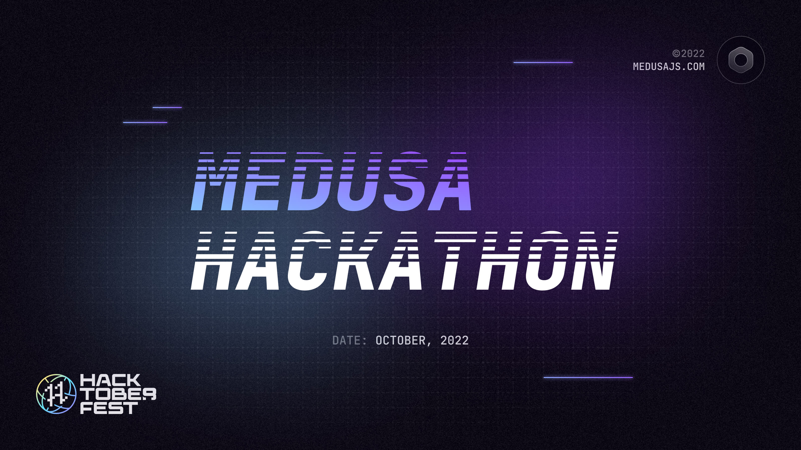

# Hackathon 2022 Submissions Overview

<h4 align="center">
  <a href="https://twitter.com/medusajs">Twitter</a> |
  <a href="https://www.linkedin.com/company/medusajs">LinkedIn</a> |
  <a href="https://discord.gg/medusajs">Discord</a> |
  <a href="https://github.com/medusajs/medusa">GitHub</a> |
  <a href="https://medusajs.com/">Website</a>
</h4>

This repository includes a list of all GitHub submissions to [Medusa’s Hackathon 2022](https://medusajs.com/blog/medusa-hackathon-warming-up-for-hacktoberfest/).

## How do I submit my project?

This repository is not open for sending submissions. Please send your submissions to [this discussion thread](https://github.com/medusajs/medusa/discussions/2280) instead. Our team will weekly update this repository with new submissions.

---

## Submissions

| Project Name | Team | Submission Type | Description  |
| --- | --- | --- | --- |
|  |  |  |  |
